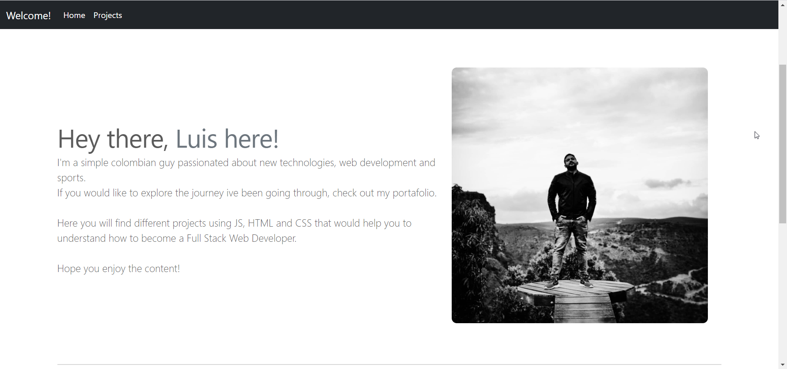

# My Portafolio
 

# lucaza21.github.io/repository/

## Description: 
This is the first portafolio made for  MIT xPRO's Professional Certificate in Coding: Full Stack Development with MERN (Online) Program.

## Usage: 
It helps to understand how to use HTML, CSS and BOOTSTRAP to create a personal blog and show some projects made during the course.

## Support:
Email: <luis.carrasquilla.z@gmail.com> / 
Linkedin: **[Luis Carrasquilla](https://www.linkedin.com/in/luis-carrasquilla/)** 

## Roadmap
I'm planning to add more styles and transitions and a cool background effect to the pages.

## License information:  
This project has been made in the MIT xPRO's Professional Certificate in Coding: Full Stack Development with MERN
